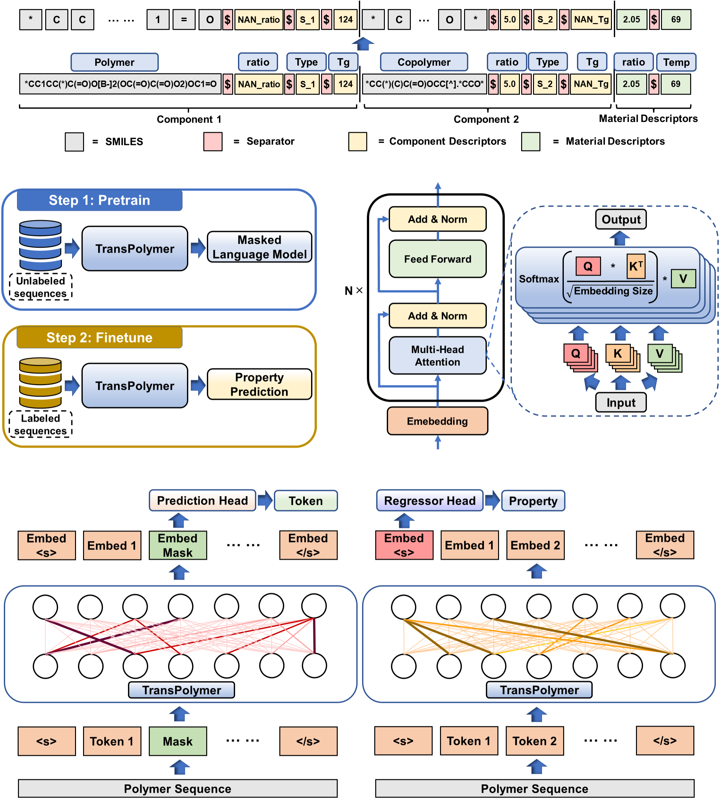

## TransPolymer ##

#### npj Computational Materials [[Paper]](https://www.nature.com/articles/s41524-023-01016-5) [[arXiv]](https://arxiv.org/abs/2209.01307) [[PDF]](https://www.nature.com/articles/s41524-023-01016-5.pdf) </br>
[Changwen Xu](https://changwenxu98.github.io/), [Yuyang Wang](https://yuyangw.github.io/), [Amir Barati Farimani](https://www.meche.engineering.cmu.edu/directory/bios/barati-farimani-amir.html) </br>
Carnegie Mellon University </br>



This is the official implementation of <strong><em>TransPolymer</em></strong>: ["TransPolymer: a Transformer-based language model for polymer property predictions"](https://www.nature.com/articles/s41524-023-01016-5). In this work, we introduce TransPolymer, a Transformer-based language model, for representation learning of polymer sequences by pretraining on a large unlabeled dataset (~5M polymer sequences) via self-supervised masked language modeling and making accurate and efficient predictions of polymer properties in downstream tasks by finetuning. If you find our work useful in your research, please cite:
```
@article{xu2023transpolymer,
  title={TransPolymer: a Transformer-based language model for polymer property predictions},
  author={Xu, Changwen and Wang, Yuyang and Barati Farimani, Amir},
  journal={npj Computational Materials},
  volume={9},
  number={1},
  pages={64},
  year={2023},
  publisher={Nature Publishing Group UK London}
}
```

## Getting Started

### Installation

Set up conda environment and clone the github repo

```
# create a new environment
$ conda create --name TransPolymer python=3.9
$ conda activate TransPolymer

# install requirements
$ conda install pytorch==1.12.0 torchvision torchaudio cudatoolkit=11.3 -c pytorch
$ pip install transformers==4.20.1
$ pip install PyYAML==6.0
$ pip install fairscale==0.4.6
$ conda install -c conda-forge rdkit=2022.3.4
$ conda install -c conda-forge scikit-learn==0.24.2
$ conda install -c conda-forge tensorboard==2.9.1
$ conda install -c conda-forge torchmetrics==0.9.2
$ conda install -c conda-forge packaging==21.0
$ conda install -c conda-forge seaborn==0.11.2
$ conda install -c conda-forge opentsne==0.6.2

# clone the source code of TransPolymer
$ git clone https://github.com/ChangwenXu98/TransPolymer.git
$ cd TransPolymer
```

### Dataset

The pretraining dataset is adopted from the paper ["PI1M: A Benchmark Database for Polymer Informatics"](https://pubs.acs.org/doi/10.1021/acs.jcim.0c00726). Data augmentation is applied by augmenting each sequence to five. Pretraining data with smaller sizes are obtained by randomly picking up data entries from PI1M dataset.

Ten datasets, concerning different polymer properties including polymer electrolyte conductivity, band gap, electron affinity, ionization energy, crystallization tendency, dielectric constant, refractive index, and p-type polymer OPV power conversion efficiency, are used for downstream tasks. Data processing and augmentation are implemented before usage in the finetuning stage. The original datasets and their sources are listed below:

PE-I: ["AI-Assisted Exploration of Superionic Glass-Type Li(+) Conductors with Aromatic Structures"](https://pubs.acs.org/doi/10.1021/jacs.9b11442)

PE-II: ["Database Creation, Visualization, and Statistical Learning for Polymer Li+-Electrolyte Design"](https://pubs.acs.org/doi/full/10.1021/acs.chemmater.0c04767)

Egc, Egb, Eea, Ei, Xc, EPS, Nc: ["Polymer informatics with multi-task learning"](https://www.sciencedirect.com/science/article/pii/S2666389921000581)

OPV: ["Computer-Aided Screening of Conjugated Polymers for Organic Solar Cell: Classification by Random Forest"](https://pubs.acs.org/doi/10.1021/acs.jpclett.8b00635)

The original and processed datasets are included in the data folder. 

### Tokenization
`PolymerSmilesTokenization.py` is adapted from RobertaTokenizer from [huggingface](https://github.com/huggingface/transformers/tree/v4.21.2) with a specially designed regular expression for tokenization with chemical awareness.

### Checkpoints
Pretrained model can be found in `ckpt` folder.

## Run the Model

### Pretraining
To pretrain TransPolymer, where the configurations and detailed explaination for each variable can be found in `config.yaml`.
```
$ python -m torch.distributed.launch --nproc_per_node=2 Pretrain.py
```
<em>DistributedDataParallel</em> is used for faster pretraining. The pretrained model can be found in `ckpt/pretrain.pt`

### Finetuning
To finetune the pretrained TransPolymer on different downstream benchmarks about polymer properties, where the configurations and detailed explaination for each variable can be found in `config_finetune.yaml`.
```
$ python Downstream.py
```

## Visualization

### Attention Visualization
To visualize the attention scores for interpretability of pretraining and finetuning phases, where the configurations and detailed explaination for each variable can be found in `config_attention.yaml`.
```
$ python Attention_vis.py
```

### t-SNE Visualization
To visualize the chemical space covered by each dataset, where the configurations and detailed explaination for each variable can be found in `config_tSNE.yaml`.
```
$ python tSNE.py
```

## Acknowledgement
- PyTorch implementation of Transformer: [https://github.com/huggingface/transformers.git](https://github.com/huggingface/transformers.git)
